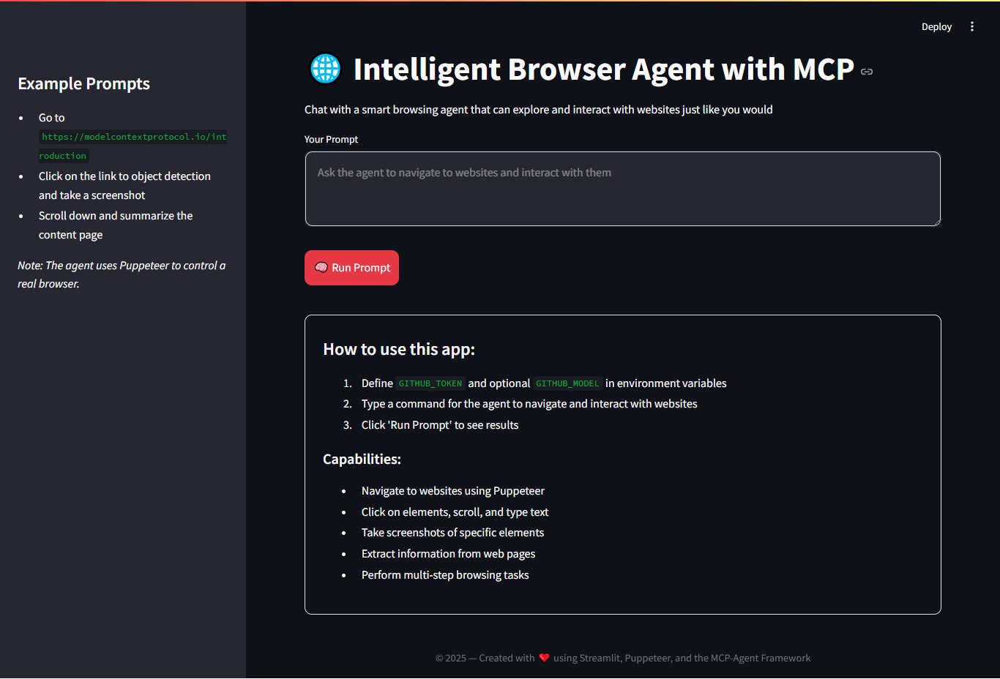

# 🌐 Intelligent Browser Agent with MCP

An interactive application built with **Streamlit** and the **MCP-Agent** framework to control a real browser using **Puppeteer**. You can send natural commands for the agent to navigate, interact with websites, take screenshots, and summarize content using a language model (LLM) like Gemini, OpenAI, or Azure OpenAI.



---

## 🚀 Features

- Navigate to websites with natural language commands.
- Perform actions like click, scroll, type, and extract data.
- Take screenshots of web elements.
- Summarize content using LLMs (Gemini, Azure, OpenAI).
- Visual interface built with Streamlit.
- Easily switch between multiple LLM providers.

---

## 🛠️ Requirements

- Python 3.10+
- Node.js (for Puppeteer)
- `npx` installed
- API Key for Gemini, Azure, or OpenAI

---

## 📦 Installation

```bash
git clone https://github.com/your-username/your-repo.git
cd your-repo

# Create virtual environment
python -m venv .venv
source .venv/bin/activate  # On Windows: .venv\Scripts\activate

# Install dependencies
pip install -r requirements.txt
```

---

## 🔐 Configuration

Create a `.env` file in the root directory with the following variables based on the LLM provider you use:

### 🌟 Gemini (Google AI)

```env
GEMINI_API_KEY=your_gemini_key
GEMINI_MODEL=gemini-pro
```

### ☁️ Azure OpenAI (optional)

```env
AZURE_API_KEY=your_azure_key
AZURE_BASE_URL=https://your-resource-name.openai.azure.com/
GITHUB_MODEL=gpt-4
```

### 🔓 OpenAI (optional)

```env
OPENAI_API_KEY=your_openai_key
OPENAI_BASE_URL=https://api.openai.com/v1
GITHUB_MODEL=gpt-4
```

---

## 🧠 Run the App

```bash
streamlit run app.py
```

This opens a web interface where you can enter commands like:

```
Go to https://modelcontextprotocol.io/introduction
Click on the link to object detection
Take a screenshot of the section
```

---

## 📋 Example Commands

- `Go to Google.com and search for "Machine Learning"`
- `Scroll down and summarize the content`
- `Click on the first link and extract the heading text`
- `Take a screenshot of the main section`

---

## 📁 Project Structure

```
📁 mcp_browser_agent
├── browser-mcp-agent-v1.py        # Main Streamlit app
├── browser-mcp-agent-v2.py        # Main Chainlit app
├── .env.sample                    # Environment variables
├── mcp_agent.config.yaml          # mcp agent configs
├── mcp_agent.secrets.sample.yaml
├── requirements.txt               # Dependencies
└── README.md                      # This file
```

---

## 📄 License

This project is licensed under the MIT License - free to use, modify, and distribute.

---

## 🤝 Credits

This project uses:

- [Streamlit](https://streamlit.io)
- [Model Context Protocol](https://modelcontextprotocol.io)
- [Puppeteer](https://pptr.dev)
- [Google Gemini](https://ai.google.dev), [Azure OpenAI](https://learn.microsoft.com/en-us/azure/cognitive-services/openai/overview), [OpenAI](https://openai.com)
